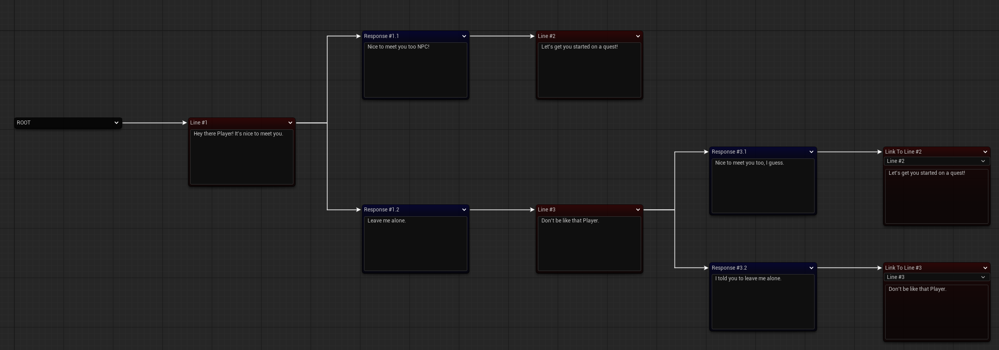
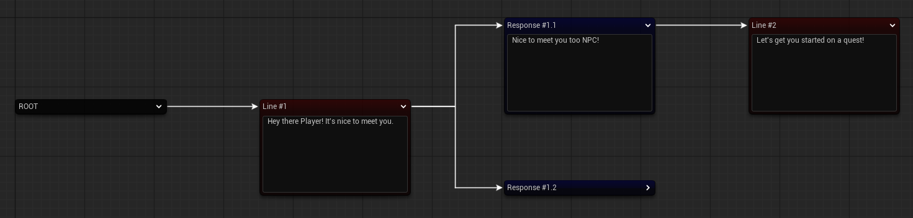
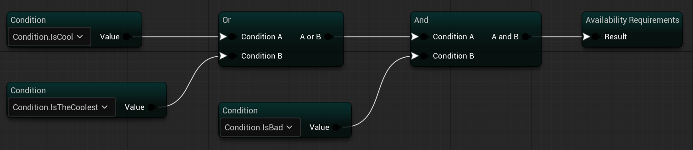
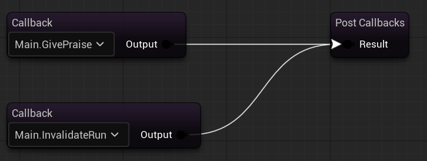
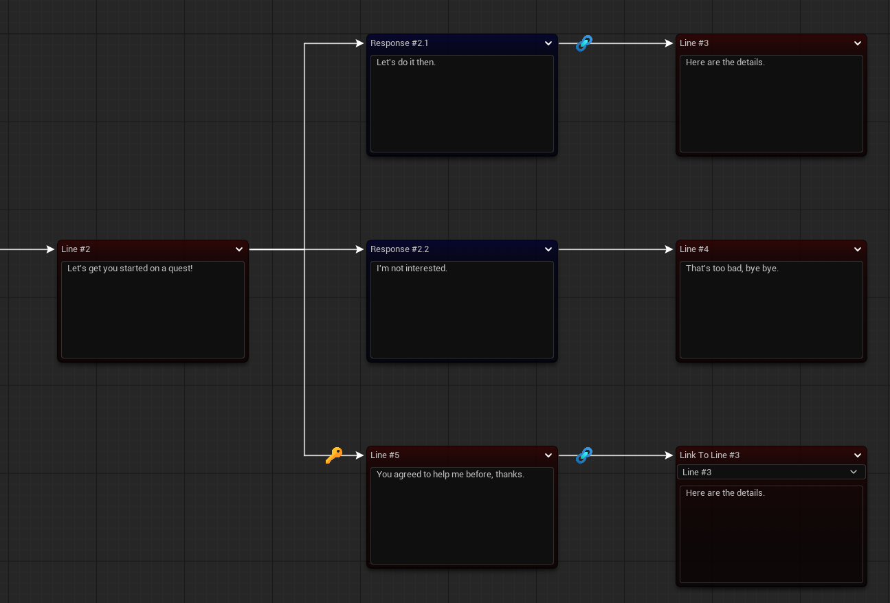

# Story System

**Story System** is a toolkit designed for creating rich, interactive narrative experiences in games. While still a work in progress, it already supports dialogue graph editing and will eventually include character database, rule-driven logic, cinematic timelines, and quest editor.

The system is designed to give game developers full control over storytelling mechanics, from branching dialogue paths to complex callback logic.

## Dialogue Graph (WIP)

### Current Features

-   **Branching Dialogue Paths**

    

-   **Node Collapsing**

    
    
-   **Node Inner Graph**
    
    -   Requirements for node availability
  
        
        
    -   Callbacks after node
 
        

-   **Inner State Visualization: Key - Requirements & Link - Callbacks**

    

### Planned Features

-   Separating dialogue lines per character

### How To Use

-   **Create Dialogue Graph:** RMB on `Content Browser` then select `Miscellaneous/Dialogue Asset`

-   **Open Dialogue Graph:** Double LMB on `Dialogue Asset`

-   **Modify Dialogue Graph:** RMB on existing `Node` inside `Dialogue Asset` (`Context Menu` will pop up)

-   **Modify Requirements And Callbacks For Particular Node:**

    - Double LMB on existing `Node` (`Node Graph` will pop up)
    - RMB when inside `Node Graph` (`Context Menu` will pop up)

-   **Export To Runtime UObject:** RMB on `Dialogue Asset` then click `Export to runtime UObject`

-   **Copy JSON To Clipboard:** RMB on `Dialogue Asset` then click `Copy JSON to clipboard`

# Rule System (WIP)

### Current Features

- Asset-based rules creation `RMB/Miscellaneous/Data Asset/Rule Asset`
- GUID-oriented rule recognition
- Rule database fetching conditions from `Rules/Conditions` and callbacks from `Rules/Callbacks`

### Planned Features

- Browser for rules
- Validator for assets
- Parametrized rules (?)

## Roadmap

1.  Character Database
2.  Cinematic Timeline
3.  Quest Editor

## Getting Started

> Instructions will be added soon once core systems stabilize.

## Contributing

Story System is open for contributions! If you'd like to help expand features, improve documentation, or provide bug fixes, please fork the repository and submit a pull request.
