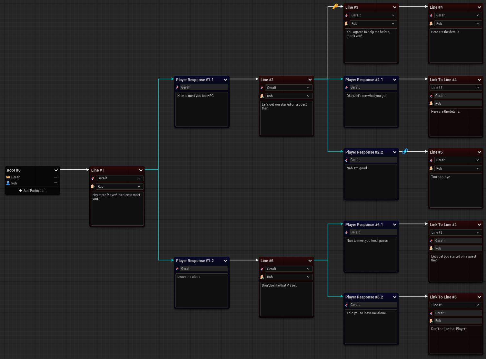
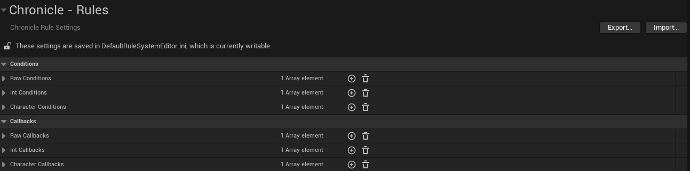
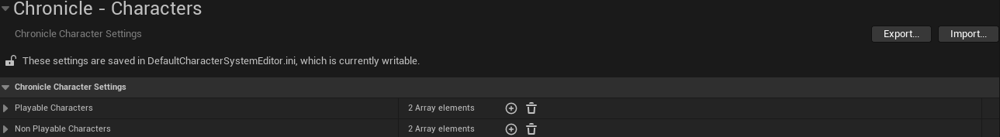

  

**Chronicle** is an Unreal Engine plugin for building narrative-driven games. It gives developers a visual way to create branching dialogues, hook up game logic through a rule system, manage characters, and cinematic timelines - all from within the editor.

## Modules

Chronicle is divided into separate modules for clarity and easier maintenance. Each module has its own detailed README in the `Docs/` folder.

### Dialogue System

[See full Dialogue System documentation →](Docs/DialogueSystem.md)

### Cinematic Timeline

[See full Cinematic Timeline documentation →](Docs/CinematicTimeline.md)

### Rule System

[See full Rule System documentation →](Docs/RuleSystem.md)

### Character System

[See full Character System documentation →](Docs/CharacterSystem.md)

## Roadmap (ish)

Planned features for Chronicle in no particular order:

- Extending Cinematic Timeline (animations support, more fancy sequences generation, flow debugger)
- Nice looking UI for Rules and Characters setup
- Rules resolving runtime system
- More restrictive Dialogue Graphs creation (to prevent setup errors)
- Localization support

## Installation

1.  Clone or download this repository
2.  Place the plugin in: `(Project)/Plugins/Chronicle`
3.  Open the project in Unreal Engine
4.  Enable  **Chronicle**  in: `Edit → Plugins → Tools`
5.  Restart the editor

## Requirements

-   Unreal Engine 5.x
-   Editor build

## How To Use

Usage and integration instructions are included in each module’s README:

- [Dialogue System](Docs/DialogueSystem.md) – Create and manage branching conversations with visual nodes
- [Cinematic Timeline](Docs/CinematicTimeline.md) – Convert dialogue graphs to in-game cinematic sequences
- [Rule System](Docs/RuleSystem.md) – Define game logic and conditions
- [Character System](Docs/CharacterSystem.md) – Manage characters

## Contributing

Chronicle is open for contributions! If you'd like to help expand features, improve documentation, or provide bug fixes, please fork the repository and submit a pull request.
